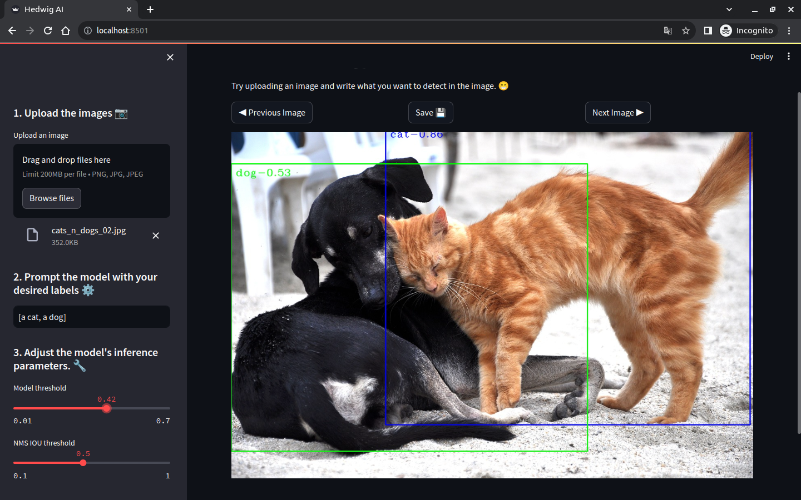
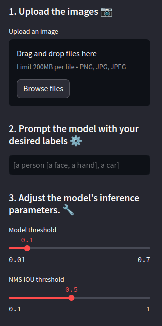

<p align="center" width="100%">

</p>

# 🦉 Hedwig-IA 🦉

Hedwig is an advanced tool designed for image labeling, optimizing the process for detection models like YOLO. It works by interpreting textual descriptions of the objects present in an image, allowing precise and automated detection of these elements. Users can then export the labels in a compatible format for training AI models, specifically in a JSON file following the Labelme format (Currently, this is the only format option available). With Hedwig, the image tagging process becomes faster and more efficient.

- **Available in 🤗 Spaces [here](https://huggingface.co/spaces/CristianC/Hedwig).**

<p align="center">
</p>

## 👍 Details

This tool is presented as an intuitive graphical user interface, developed with Streamlit. It is powered by a multimodal model, [OWL-ViT](https://huggingface.co/docs/transformers/model_doc/owlvit). To ensure optimal performance, especially in terms of processing speed and efficiency, the tool has been optimized for use on NVIDIA devices, leveraging [TensorRT](https://github.com/NVIDIA-AI-IOT/nanoowl) technology.

## 🛠️ Setup

To use this tool, it is recommended to use a Docker container, which includes all the dependencies necessary for its correct functioning. It is suggested to have the following tools installed in the specified versions:

* Docker v20.10.22
* Docker compose v1.29.2
* [Nvidia-docker](https://docs.nvidia.com/datacenter/cloud-native/container-toolkit/install-guide.html)

**Important note:** This solution is optimized for NVIDIA 3000 series graphics cards (3090 ti and A10G models tested ✅, 4000 series not yet tested).

To deploy the tool to a local environment, run the following command in the terminal:

```bash
docker run --name hedwig_container -d --gpus all -p 7860:7860 cristiancristanchot/hedwig_ai:latest
```
Afterwards, access the tool through the following URL in your browser:

[http://localhost:7860/](http://localhost:7860/)


## 🤓 Instructions for use

### General description

<p align="center" width="100%">

</p>

The workflow consists of uploading one or more images to the tool and through the prompt and the adjustment of the inference parameters, adjust the model predictions to the desired results. When the desired results are obtained, the results must be downloaded before to move to another image since the solution does not store the previous results, when downloading a json is obtained which has the labels as they appeared in the predictions.

### How to make prompts to the model

To make prompts for the model it is necessary to follow the following format:

```
[object 1, object 2, object 3]
```

Where each object refers to an object that is sought to be detected.

**Important Note:** It is necessary to use **a** or **an** before each word, but the system automatically removes them when generating the labels.

To make Tree predictions, it is recommended to follow the following format:

```
[object 1[subcompoment 1, subcomponent 2], object 2]
```
What Tree predictions allow is the detection of subcomponents or parts of the main object, such as detecting the eyes and mouth within a face.

```
[a face[an eye, a mounth]]
```

<p align="center">
</p>


### Model inference parameters

<p align="center" width="100%">

</p>

The two main parameters to adjust the model predictions are:

* Model threshold: This parameter filters the model predictions based on their confidence. If this parameter is lowered, more predictions are obtained in the image but also more false positives can occur in the detections.
* NMS IOU theshold: This parameter is the IOU used in Non Max Supression that is applied to the model predictions to improve their quality, this parameter helps to unify the predictions detected in an area.


## 👏 Acknowledgement

* [NanoOWL](https://github.com/NVIDIA-AI-IOT/nanoowl).